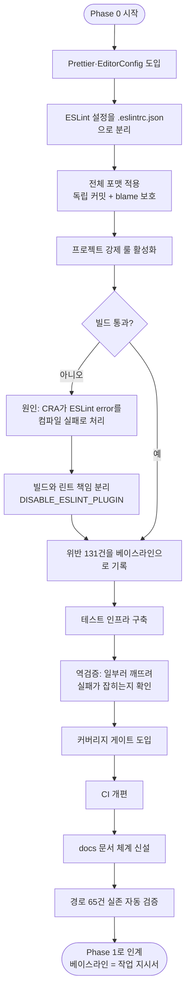
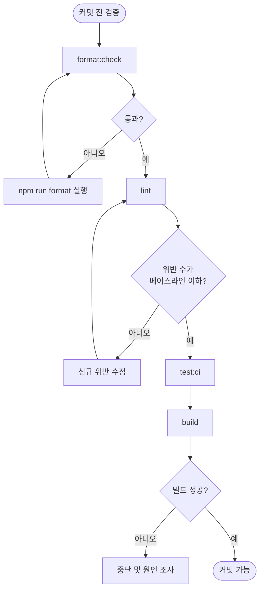

# 코드 품질 체계 및 문서 구조 확립 (전면 표준화 Phase 0)

## 개요

전면 표준화 리팩토링의 첫 단계다. 이 프로젝트는 리팩토링이 중단된 상태였고, 근본 원인은 **"좋은 코드"의 기준이 문서에만 있고 도구로 강제되지 않았다는 점**이었다. `claude.md`에 "console.log 금지"라 적혀 있었지만 25곳이 존재했고, "theme.js를 쓰라"고 적혀 있었지만 4개 파일만 사용했으며, 존재하지 않는 `/login`·`/signup` 라우트가 기술되어 있었다.

이번 작업은 위반을 고치지 않는다. **판정 기준을 세우는 것**이 목적이다. ESLint 룰을 켜면 그 위반 목록이 그대로 이후 Phase의 작업 지시서가 된다. 총 131건의 위반이 검출되어 베이스라인으로 기록됐다.

49개 파일이 변경됐고, 그중 29개는 Prettier 전체 적용에 따른 포맷 전용 변경이다.

## 기능 흐름

### 품질 게이트 파이프라인

## 변경 사항

### 린트·포맷 설정

- `.editorconfig`: 신규. `charset = utf-8`, `end_of_line = lf` 고정. `src/utils/axios.jsx`의 인코딩 손상(BOM + 모지바케) 재발 방지가 존재 이유
- `.prettierrc.json`: 신규. printWidth 100, 큰따옴표, LF
- `.prettierignore`: 신규. 인코딩 손상 상태인 `src/utils/axios.jsx`, GitHub Actions가 재생성하는 `CHANGELOG.json`/`CHANGELOG.md` 제외
- `.eslintrc.json`: 신규. `package.json`의 `eslintConfig`에서 이전 + 강제 룰 6종
- `.eslintignore`: 신규
- `.git-blame-ignore-revs`: 신규. 포맷 전용 커밋(`252d930`)을 blame에서 제외

### 빌드 스크립트

- `package.json`: `start`/`build`에 `DISABLE_ESLINT_PLUGIN=true` 적용, `lint`·`lint:fix`·`format`·`format:check`·`test:ci` 스크립트 추가, `jest.coverageThreshold` 추가, `eslintConfig` 제거

### 테스트 인프라

- `src/setupTests.js`: 신규. 기존에 없어서 `@testing-library/jest-dom` matcher가 등록되지 않은 상태였다
- `src/utils/TimeUtil.test.js`: 신규. 7개 테스트. 테스트 인프라 동작 검증 겸 첫 유닛 테스트

### CI

- `.github/workflows/PROJECT-CI.yaml`: 린트 단계의 조건부 스킵 제거, 존재하지 않는 `jest-sonar-reporter` 참조 제거, 실행 순서 정리, PR 댓글의 거짓 통과 보고 수정

### 문서

- `docs/README.md`: 신규. 문서 인덱스 + 어디에 무엇을 쓸지 판단하는 규칙
- `docs/ARCHITECTURE.md`: 신규. 디렉토리 구조, 실제 라우팅 표, 상태 관리, API 통신
- `docs/CONVENTIONS.md`: 신규. 린트로 강제할 수 없는 규칙만
- `docs/TESTING.md`: 신규. 테스트 3계층 가이드
- `docs/DESIGN-SYSTEM.md`: 신규. Phase 3 준비용 골격 + 현황
- `docs/GAME-FLOW.md`: 신규. 현행 스토리 분기·점수 임계치. Phase 4 회귀 테스트의 기대값 근거
- `claude.md`: 전면 재작성. 존재하지 않는 `/login`·`/signup` 기술 제거, 작업 파이프라인 명문화
- `.env.example`: 신규. Phase 1의 `.env` 도입 준비

### 포맷 전용 변경

- `src/` 하위 27개 파일 + `README.md` + `claude.md`: Prettier 적용. 따옴표·화살표 괄호·trailing comma·줄바꿈만 변경되며 제어 흐름은 그대로다

## 주요 구현 내용

### 강제 룰 6종과 검출 결과

| 룰                            | 막는 것                    | 검출              |
| ----------------------------- | -------------------------- | ----------------- |
| `no-console`                  | `console.*` 사용           | 25건              |
| `no-restricted-properties`    | `localStorage` 직접 접근   | 16건              |
| `no-restricted-imports`       | `axios` 패키지 직접 import | 0건 (회귀 방지용) |
| `import/order`                | import 정렬                | 75건              |
| `no-unused-vars`              | 데드코드                   | 10건              |
| `react-hooks/exhaustive-deps` | 의존성 누락                | 5건               |

`localStorage` 16건은 사전 조사에서 예측한 수치와 정확히 일치했다. `no-restricted-imports`가 0건인 것은 정상이며, 모든 호출부가 이미 axios 인스턴스를 쓰고 있어 이 룰은 회귀 방지 목적이다.

### `no-restricted-globals`를 쓰지 않은 이유

`eslint-config-react-app` 프리셋이 `no-restricted-globals`에 `confusing-browser-globals` 목록(`event`, `name`, `length` 등 실수하기 쉬운 브라우저 전역)을 이미 설정해 두었다. 같은 룰 이름을 재정의하면 **프리셋 설정이 병합되지 않고 통째로 대체되어 기존 보호가 조용히 사라진다.** 계획 검토 단계에서 발견해 `no-restricted-properties`로 교체했다.

이 프로젝트의 `localStorage` 사용은 전부 `localStorage.getItem("...")` 형태이므로 프로퍼티 기반 제한으로 충분히 잡힌다.

### 빌드와 린트의 책임 분리

강제 룰을 켠 직후 `npm run build`가 실패했다. CRA는 webpack ESLintPlugin을 통합해 **ESLint error를 컴파일 실패로 처리**한다. `CI=false`는 warning을 error로 승격시키지 않을 뿐, 진짜 error는 여전히 빌드를 막는다.

이대로 두면 Phase 1이 끝날 때까지 빌드도 배포도 불가능해진다. `start`/`build`에 `DISABLE_ESLINT_PLUGIN=true`를 적용해 분리했다.

임시 우회가 아니라 영구 조치다:

- 빌드 도구가 린트를 겸하는 것은 관심사 혼합이다. 린트는 `npm run lint`가 전담하고 CI의 독립 단계가 게이트한다
- 린트 실패가 곧 배포 불가가 되는 결합은 위험하다. 긴급 핫픽스가 무관한 린트 위반 하나에 막힌다
- `npm start`의 ESLint 오버레이가 화면을 덮으면 Phase 3의 3해상도 전수 캡처가 불가능해진다

분리 후 빌드는 `Compiled successfully`, 린트는 여전히 131건을 검출한다. 게이트는 그대로 유지된다.

### 포맷 전용 커밋 분리

포맷 변경은 diff가 거대해 로직 변경과 섞이면 리뷰가 불가능해진다. 포맷만 담은 커밋(`252d930`)을 분리하고 `.git-blame-ignore-revs`에 등록했다.

검증 결과:

- `git diff --ignore-all-space` 결과가 따옴표·화살표 괄호·trailing comma뿐이며 제어 흐름 변경 없음
- 빌드 통과, 번들 크기 변화 +16B
- `git blame`이 여전히 원 작성 커밋(`82381f57`, 2025-09-29)을 가리킴

### 테스트 인프라 역검증

`TimeUtil.formatPlayTime`을 첫 테스트 대상으로 골랐다. 시간·네트워크·DOM에 의존하지 않는 순수 함수라, 실패하면 원인이 인프라 문제임이 확실하기 때문이다.

7개 테스트가 통과한 뒤, 일부러 기대값을 `"45초"`에서 `"46초"`로 바꿔 실패가 잡히는지 확인했다(`Expected: "46초" / Received: "45초"`). **테스트가 조용히 실행되지 않고 있어도 초록색으로 보이기 때문에** 인프라를 새로 세울 때는 이 역검증이 필요하다.

커버리지 게이트도 실제로 차단됨을 확인했다 — `src/utils/` 14.7%, `src/hooks/` 0%로 임계치 80% 미달.

날짜 테스트는 값이 아닌 형식을 검증한다. CI는 UTC, 로컬은 KST라 값을 고정하면 한쪽에서 반드시 깨진다.

### 문서 정확성 자동 검증

문서가 코드와 어긋난 것이 이번 작업의 출발점이므로, 문서 내 백틱으로 감싼 `src/` 경로가 실제로 존재하는지 자동 검사했다. 고유 경로 65건 전부 실존을 확인했다.

## 주의사항

### 현재 품질 게이트 상태

| 명령                     | 결과                 | 비고                 |
| ------------------------ | -------------------- | -------------------- |
| `npm run format:check`   | 통과                 | 반드시 통과해야 한다 |
| `npm run lint`           | 실패 (131 errors)    | 정상. Phase 1 대상   |
| `npm run test:ci`        | 실패 (커버리지 미달) | 정상. Phase 1 대상   |
| `CI=false npm run build` | 통과                 | 반드시 통과해야 한다 |

린트와 테스트가 실패하는 것은 현재 정상이다. 중요한 것은 **새 변경이 위반 수를 늘리지 않는 것**이며, 기준선은 `docs/superpowers/plans/phase0-lint-baseline.txt`에 있다.

CI는 이 두 단계를 `continue-on-error`로 두어 결과만 보고한다. Phase 1에서 위반을 0으로 만든 뒤 차단 게이트로 전환한다.

### 실행 중 추가로 발견된 것

**프로젝트 이름이 5곳에서 다르다.** 사용자에게 보이는 이름만 두 개다.

| 위치                              | 이름                  |
| --------------------------------- | --------------------- |
| 실제 화면 (`src/pages/Home.jsx`)  | Re: WAVE              |
| 브라우저 탭 (`public/index.html`) | Save Her - Game       |
| PWA (`public/manifest.json`)      | Save Her Game         |
| `README.md`                       | BAGEL - 그녀를 구하라 |
| `package.json`                    | bagle                 |

어느 것이 정식 명칭인지 확인이 필요해 Phase 5의 미결 사항으로 등록했다. `package.json`의 `name` 변경은 배포 파이프라인에 영향을 줄 수 있어 별도 검토가 필요하다.

**`src/pages/Result.jsx`의 잘못된 에러 메시지.** 게임 결과 전송 실패 시 "중복된 이메일입니다"가 표시된다. 회원가입 쪽 문구가 복사되어 남은 것으로 보인다. Phase 2에서 수정한다.

### 초기 진단 정정

조사 초기에 "Main4가 도달 불가능한 데드 페이지"라고 판단했으나 오류였다. `BagelSelectPageComponent.jsx:171-177`에 분기가 구현되어 있고 `url` prop은 기본값일 뿐 런타임에 `setBase()`로 덮어쓰인다.

Main2(카페)에서 돈을 줍는 선택이 Main4(우산)로, 그렇지 않으면 Main3(동굴)로 갈린 뒤 둘 다 Main5(해변)로 합류한다. `data4`의 도입부 "얻은 돈으로 편의점에서 우산을 사올 수 있었다"가 돈 줍기 선택과 정확히 연결된다. 의도된 분기이며 정상 동작한다. `docs/GAME-FLOW.md`에 기록했다.

### 환경 관련

- 작업 시작 시점에 시스템에 Node.js가 설치되어 있지 않아 설치가 선행됐다 (Node 26)
- CI는 Node 20을 쓴다. 버전 불일치가 있으므로 "로컬에선 되는데 CI에선 깨지는" 경우 이 차이를 먼저 의심한다
- `package.json`의 `start`/`build`가 유닉스 셸 문법(`VAR=value cmd`)을 쓴다. Windows에서 개발하려면 `cross-env`가 필요하다

### 다음 단계

Phase 1은 `docs/superpowers/plans/phase0-lint-baseline.txt`의 131건을 작업 목록으로 삼는다. 인증/API 레이어를 통일하고 레거시를 제거한 뒤, CI의 `continue-on-error`를 제거해 차단 게이트로 전환한다.
