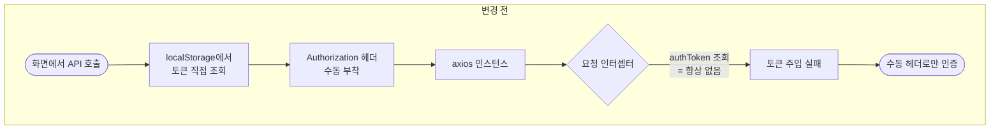
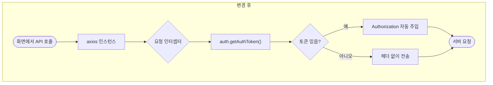
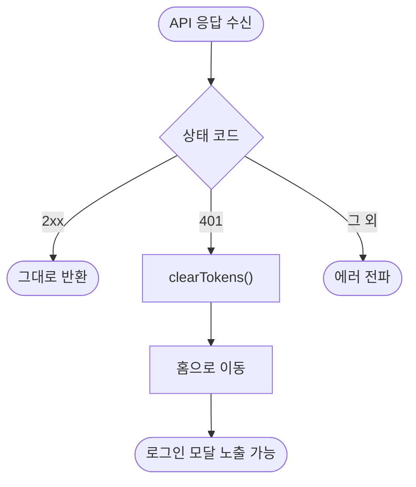

# 인증/API 레이어 통일 및 레거시 제거 (전면 표준화 Phase 1)

## 개요

Phase 0에서 켠 ESLint 룰이 검출한 **위반 131건을 0으로 만들고**, 흩어져 있던 인증·API·로깅 경로를 하나로 모았다. CI는 이제 결과만 보고하는 상태에서 **실제 차단 게이트**로 바뀌었다.

가장 중요한 발견은 **axios 요청 인터셉터가 죽어 있었다는 것**이다. 저장되지 않는 키(`authToken`)를 읽고 있어 토큰이 한 번도 주입되지 않았고, 그래서 모든 호출부가 `Authorization` 헤더를 수동으로 다시 붙이고 있었다. 인스턴스를 중앙화한 의미가 없는 상태였다.

52개 파일이 변경됐고 테스트가 7개에서 84개로 늘었다.

## 기능 흐름

### 인증 요청 경로의 변화

### 401 응답 처리

## 변경 사항

### 유틸 계층

- `src/utils/axios.js`: `axios.jsx`에서 이름 변경(`git mv`로 히스토리 보존). UTF-8 재작성으로 인코딩 손상 복구. 인터셉터가 `auth.js`를 쓰도록 수정. 401 목적지를 `/login`에서 `/`로 정정. Base URL을 환경변수화
- `src/utils/logger.js`: 신규. `auth.js`에 있던 로거를 분리
- `src/utils/storage.js`: 신규. 배경음 음소거 등 UI 설정 전용
- `src/utils/auth.js`: 로거 제거, 익명 default export 정정

### 라우팅

- `src/components/RequireAuth.jsx`: `auth.js`의 `isAuthenticated()` 사용으로 수정
- `src/Route.jsx`: 인라인 `ProtectedRoute` 제거, 보호 라우트 13개를 `RequireAuth`로 교체

### 화면·훅

- `src/pages/` 12개 파일: `localStorage` 직접 접근과 수동 `Authorization` 헤더 제거, `console.*`을 로거로 교체
- `src/hooks/useRankingData.js`: 토큰 조회·수동 헤더 제거
- `src/hooks/useInfiniteScroll.js`: 로거 적용
- `src/components/ImageGallery.jsx`: 네비게이션 함수를 `useCallback`으로 안정화
- `src/components/DialogueSystem.jsx`: 미사용 keyframes 제거, 훅 의존성 예외 처리
- `src/pages/Home.jsx`: 인증·설정·로깅 전부 유틸 경유로 교체, 미사용 styled 정의 3개 제거

### 테스트

- `src/utils/auth.test.js`, `axios.test.js`, `logger.test.js`, `storage.test.js`: 신규
- `src/utils/TimeUtil.test.js`: 상대 시간·상세 일시 검증 보강
- `src/hooks/useRankingData.test.js`, `useInfiniteScroll.test.js`: 신규
- `package.json`: axios CJS 매핑, 데이터 파일 커버리지 제외

### CI·문서

- `.github/workflows/PROJECT-CI.yaml`: `continue-on-error` 제거
- `docs/ARCHITECTURE.md`, `docs/CONVENTIONS.md`, `claude.md`: 현재 코드와 동기화

## 주요 구현 내용

### 죽어 있던 인터셉터

요청 인터셉터가 `localStorage.getItem('authToken')`을 읽었는데 이 키는 어디에서도 저장되지 않는다. 실제 키는 `refreshToken`이다. 인터셉터는 항상 토큰 없이 통과했고, 각 호출부가 헤더를 수동으로 붙여 겨우 동작하고 있었다.

인터셉터를 `auth.getAuthToken()`으로 고치자 호출부의 수동 헤더가 전부 불필요해졌다. 16곳의 토큰 조회와 그에 딸린 헤더 코드가 사라졌다.

### 저장소를 두 모듈로 나눈 이유

`localStorage`에는 두 종류가 섞여 있었다 — 인증 토큰과 배경음 음소거 설정. 음소거를 `auth.js`에 넣는 것은 부적절하고, 그렇다고 화면에서 직접 접근하면 ESLint 룰에 걸린다.

`storage.js`를 신설해 분리했다. 토큰은 보안·만료 정책이 걸리는 값이고 설정은 그렇지 않다. 같은 저장소를 쓴다고 같은 모듈에 두면 정책이 뒤섞인다.

### 훅 의존성은 룰이 아니라 동작을 기준으로 판단했다

`react-hooks/exhaustive-deps` 5건을 기계적으로 처리하지 않고 각각 판단했다.

- **Happy/Sad**: `scenes.length`는 상수값이라 의존성에 넣어도 재실행되지 않는다 → 추가
- **ImageGallery**: 네비게이션 함수를 `useCallback`으로 감쌌다. 두 함수가 `currentImageIndex`에만 의존하므로 이펙트 재실행 조건이 기존과 동일하다 → 정석 해결
- **DialogueSystem**: `nextScene`을 의존성에 넣으려면 부모의 `onComplete`까지 `useCallback`으로 안정화해야 한다. 그러지 않으면 매 렌더마다 타이머가 리셋되어 씬이 진행되지 않는다. 인트로는 게임 시작 경로라 회귀 위험이 커, 사유를 주석에 남기고 `eslint-disable`로 명시 처리했다

룰을 만족시키려고 의존성을 넣어 동작을 깨뜨리는 것보다, 사유를 남기고 미루는 편이 정직하다.

### 테스트 인프라의 두 가지 장애물

**axios가 ESM으로 배포된다.** Jest가 `import` 구문을 파싱하지 못해 테스트 스위트 자체가 실행되지 않았다. `moduleNameMapper`로 CJS 번들(`axios/dist/node/axios.cjs`)을 매핑해 해결했다. CRA 기본 매핑(`react-native`, CSS 모듈)을 함께 명시해 덮어쓰기로 인한 손실을 막았다.

**jsdom에 `IntersectionObserver`가 없다.** 모킹 클래스를 만들어 등록된 콜백을 붙잡는 방식으로 교차 상태를 흘려보냈다. 다만 `renderHook`만으로는 ref가 DOM에 연결되지 않아 옵저버 등록 경로가 실행되지 않는다. 실제 컴포넌트로 감싸 ref를 연결하는 테스트를 추가해 그 경로까지 덮었다. 구형 브라우저용 스크롤 폴백도 검증했다.

### 브라우저 실동작 검증

인증 경로를 전부 교체했으므로 단위 테스트만으로는 부족하다고 판단해 실제 브라우저로 확인했다.

- 미인증 상태에서 `/main1` 접근 → `/`로 리다이렉트
- 토큰 보유 시 `/board` 진입
- axios 인스턴스로 요청이 실제 발신되고 서버 응답을 받음
- 로거가 `랭킹 데이터 로딩 오류: AxiosError`를 출력

## 주의사항

### 서버가 401이 아닌 403을 반환한다

실측 결과 잘못된 토큰에 서버가 **403**을 준다. 인터셉터는 401만 처리하므로 **만료 토큰의 자동 로그아웃이 동작하지 않을 수 있다.** 백엔드의 401/403 응답 규약을 확인한 뒤 처리 범위를 조정해야 한다. `docs/ARCHITECTURE.md`에 기록했다.

### 동작을 바꾸지 않고 기록만 한 항목

- **타이핑 효과가 항상 비활성**: `DialogueSystem`의 `setIsTyping`을 호출하는 곳이 없어 `isTyping`이 언제나 `false`다
- **로딩 UI 없음**: `Intro`의 `loading` 상태를 참조하는 곳이 없다

둘 다 린트만 해소하고 주석으로 남겼다. 동작 변경은 해당 화면을 다루는 단계에서 함께 처리하는 편이 안전하다.

### 범위를 벗어나 함께 고친 것

`Result.jsx`에서 게임 결과 전송 실패 시 **"중복된 이메일입니다"** 알림이 떴다. 회원가입 쪽 문구가 복사돼 남은 것이다. 스펙상 다음 단계 항목이었으나 같은 `catch` 블록을 수정하는 중이라 함께 정리했다.

`Main1.jsx`의 캐릭터 정보 조회 실패 시 뜨던 `alert("Error")`도 제거했다. 사용자에게 아무 정보도 주지 않는 메시지이고, 캐릭터 이름은 기본값이 있어 게임 진행에 지장이 없다.

### 데드코드는 삭제하지 않았다

`SelectPageComponent.jsx`(253줄), `MyGameResult.jsx`(164줄)는 여전히 미사용이다. 파일 삭제는 확인이 필요한 사항이라 위반만 해소하고 파일은 남겼다.

### 남은 시각적 문제

`Board` 화면에서 styled-components의 `unknown prop "progress"` 경고가 나온다. transient prop(`$` 접두사)으로 정리해야 하며, 디자인 시스템 단계에서 처리한다.

## 다음 단계

Phase 2는 게임 진행 상태의 정합성을 다룬다. 점수가 새로고침 시 초기화되는 문제, 진행도 가드 부재, 404 페이지 부재가 대상이다.
