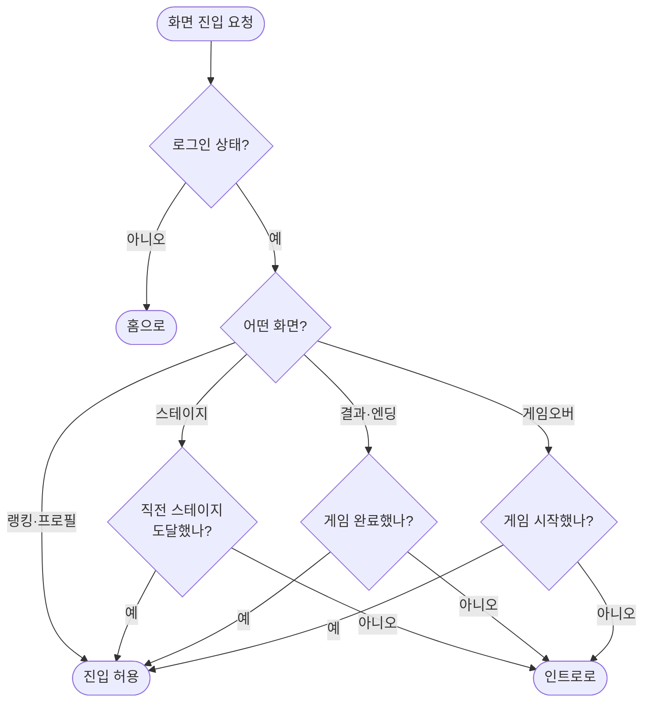
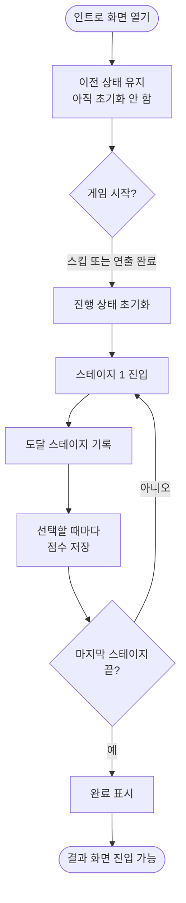

# 게임 라우팅 및 진행 상태 정합성 수정 (전면 표준화 Phase 2)

## 개요

게임 진행 상태의 정합성을 확보했다. 가장 중요한 변화는 **게임 도중 새로고침해도 점수가 유지된다**는 점이다.

기존에는 `scoreAtom`이 Recoil 메모리에만 있어 새로고침 한 번으로 그때까지 쌓은 호감도가 0이 됐다. 엔딩은 최종 점수로 결정되므로(100점 이상 happy, 50~99 middle, 50 미만 sad), 점수 유실은 곧 **플레이 결과의 유실**이었다.

함께 진행도 가드와 404 화면을 추가하고, 코드에 남아 있던 거짓 정보와 5중 복제를 걷어냈다.

## 기능 흐름

### 화면 진입 판정

### 진행 상태의 수명

## 변경 사항

### 신규

- `src/game/progress.js`: 진행 상태 영속화. 점수·최대 도달 스테이지·완료 여부를 `sessionStorage`에 보존
- `src/components/RequireProgress.jsx`: 진행도 기반 접근 가드
- `src/pages/NotFound.jsx`: 404 화면
- `src/constants/routes.js`: 경로 상수
- `src/hooks/useBackgroundMusic.js`: 배경음 재생 훅

### 수정

- `src/atom/atom.js`: `scoreAtom`에 영속화 effect 연결
- `src/Route.jsx`: 가드 3종(인증·진행도·완료) 조합, `errorElement` 연결, 경로 상수 적용, `/ranking` 레거시 제거
- `src/pages/Main1.jsx` ~ `Main5.jsx`: 진행도 기록 추가, 배경음 훅으로 교체, `Main5`의 사용되지 않는 `url` prop 제거
- `src/pages/Intro.jsx`: 게임 시작 시 진행 상태 초기화
- `src/components/GameUI/BagelSelectPageComponent.jsx`: 결과 화면 진입 전 완료 표시, 경로 상수 적용

### 테스트

- `src/game/progress.test.js`: 신규 15개. 커버리지 100%
- `src/hooks/useBackgroundMusic.test.js`: 신규 4개

## 주요 구현 내용

### 왜 sessionStorage인가

탭을 닫으면 초기화되는 편이 게임의 성격에 맞다. `localStorage`를 쓰면 다음 방문 시 이전 판의 점수가 남아 "새 게임인데 점수가 이미 80점"인 상황이 생긴다.

UI 설정(`utils/storage.js`)과 모듈을 나눈 이유는 **수명이 다르기 때문**이다. 게임 진행은 한 판의 수명을 갖고 매 게임 초기화되지만, 음소거 같은 설정은 사용자 환경으로 계속 유지되어야 한다. 같은 저장소 API를 쓴다고 같은 모듈에 두면 초기화 정책이 뒤섞인다.

### 게임오버 가드는 "완료"가 아니라 "시작"이다

구현 중 발견한 함정이다. 결과·엔딩 화면은 게임 완료자만 봐야 하지만, **게임오버는 플레이 도중 발생한다.** 완료 조건으로 막으면 실제로 게임오버를 당한 사용자가 그 화면을 보지 못하고 인트로로 튕긴다.

`requireStarted` 조건을 따로 만들어 "게임을 시작했으면 통과"로 처리했다.

### 진행도는 후퇴하지 않는다

`markStageReached`는 기록된 값보다 큰 경우에만 갱신한다. 뒤로가기로 이전 스테이지를 다시 봐도 최대 도달치가 내려가지 않으므로, 다시 앞으로 진행할 때 가드에 막히지 않는다.

### 초기화 시점을 인트로 진입이 아니라 게임 시작으로 잡았다

인트로 화면을 여는 것만으로 초기화하면, 게임 도중 인트로를 잘못 눌렀을 때 진행이 날아간다. 인트로에서 **스테이지로 넘어가는 시점**(스킵 버튼 또는 연출 완료)에 초기화한다.

### 거짓 prop 제거

`Main5.jsx`의 `url={"/happy"}`는 절대 사용되지 않았다. 스테이지 5는 `navigate("/result")`로 빠져나가기 때문이다. 코드를 읽는 사람에게 "해변 다음은 해피엔딩"이라는 잘못된 정보를 줬다. 제거했다.

## 검증

### 자동

| 명령           | 결과         |
| -------------- | ------------ |
| `format:check` | 통과         |
| `lint`         | 통과         |
| `test:ci`      | 통과 (103개) |
| `build`        | 통과         |

### 브라우저 실동작

| 검증                              | 결과                |
| --------------------------------- | ------------------- |
| 없는 주소 접근                    | 404 화면 표시       |
| 진행 없이 최종 스테이지 직접 진입 | 인트로로 리다이렉트 |
| 진행도 기록 후 진입               | 정상 진입           |
| 게임 중 새로고침                  | 점수 유지 확인      |

## 주의사항

### 가드의 목적은 보안이 아니다

클라이언트 가드이므로 저장소를 직접 조작하면 우회할 수 있다. 목적은 **정상적으로 플레이하는 사용자가 새로고침·뒤로가기·잘못된 링크로 깨진 상태에 빠지지 않게** 하는 것이다. 점수 위변조 방지는 서버 검증 영역이며 이번 범위가 아니다.

### 남은 비대칭

`Main1`만 캐릭터 이름을 조회하는 구조는 유지했다. 확인 결과 실제로 Main1에서만 필요한 값이라 비대칭이 아니라 적절한 배치였다.

## 다음 단계

Phase 3은 디자인 시스템 재확립과 대형 화면 분해를 다룬다. `Home.jsx` 2193줄, `Board.jsx` 1043줄이 대상이며, 3해상도 전수 캡처로 시각적 결함 목록을 먼저 만든 뒤 착수한다.
